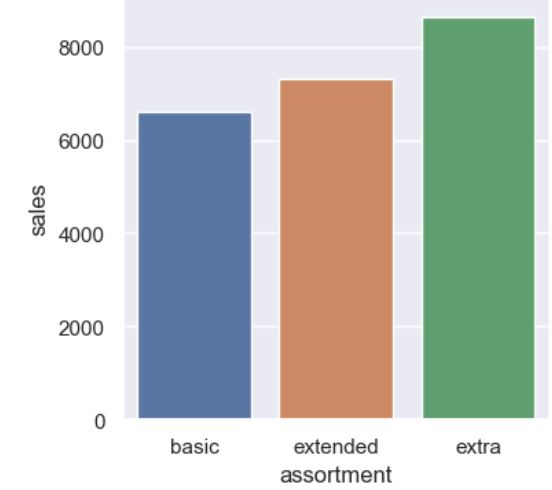
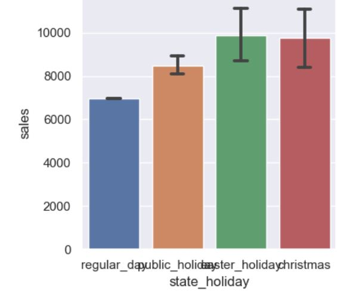
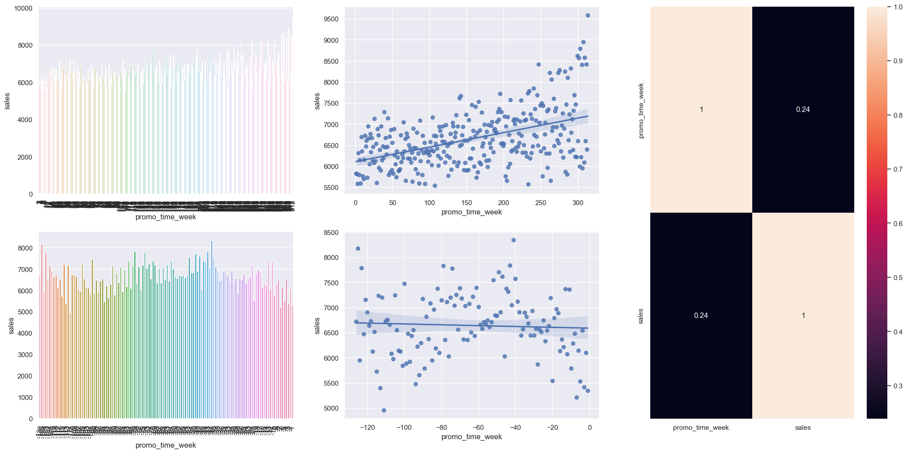

# Rede de Farmácias Rossmann
  

# Problema de Negócio:
O CFO da Rossmann quer fazer alguns investimentos para reformar todas as lojas e pediu aos gerentes de todas as redes que digam qual será a previsão de vendas de todas as lojas nas próximas 6 semanas para que ele possa decidir quanto investir em cada loja. Todos os gerentes pediram ao departamento de dados de Rossmann uma maneira de responder ao CFO com precisão.

## I. Atributos

<table style="width:100%">
<tr><th>Atributos</th><th>Descrição</th></tr>
<tr><td>Store</td><td>ID exclusivo para cada loja</td></tr>
<tr><td>Sales</td><td>quantidade de vendas por dia</td></tr>
<tr><td>Customers</td><td>número de clientes no dia</td></tr>
<tr><td>Open</td><td>indica se a loja está aberta ou fechada, 0 = closed, 1 = open</td></tr>
<tr><td>StateHoliday</td><td>indica feriado estadual. Normalmente todas as lojas, com poucas exceções, estão fechadas nos feriados estaduais. Observe que todas as escolas estão fechadas nos feriados e fins de semana. a = feriado, b = feriado da páscoa, c = natal, 0 = nenhum</td></tr>
<tr><td>SchoolHoliday</td><td>indica feriado escolar</td></tr>
<tr><td>StoreType</td><td>diferencia entre 4 modelos de loja diferentes: a, b, c, d</td></tr>
<tr><td>Assortment</td><td>descreve um nível de sortimento: a = básico, b = extra, c = estendido</td></tr>
<tr><td>CompetitionDistance</td><td>indica a distância em metros do concorrente mais próximo</td></tr>
<tr><td>CompetitionOpenSince[Month/Year]</td><td>mês e ano em que abriu o concorrente mais próximo</td></tr>
<tr><td>Promo</td><td>indica se está ocorrendo alguma promoção na loja</td></tr>
<tr><td>Promo2</td><td>é uma promoção contínua e consecutiva para algumas lojas: 0 = a loja não está participando, 1 = a loja está participando</td></tr>
<tr><td>Promo2Since[Year/Week]</td><td>indica mês e ano que a loja iniciou a Promo2</td></tr>
<tr><td>PromoInterval</td><td>indica os intervalos consecutivos em que a Promo2 é iniciada</td></tr>
</table>

# Premissas de Negócio:

* O sortimento (variedade) do tipo extra é maior do que o estendido e o básico.
* Lojas que possuem "Na" em "competition_distance", não possuem concorrentes por perto.

# Estratégia de Negócio:

Etapa 01 - Entedimento do problema de négocio.

Etapa 02 - Download do dataset diretamente do <a href="https://www.kaggle.com/competitions/rossmann-store-sales/data" target="_blank">Kaggle</a>.

Etapa 03 - Limpeza do conjunto de dados removendo valores discrepantes, valores NA e recursos desnecessários.

Etapa 04 - Exploração os dados (EDA) para criar hipóteses, gerar insights e validá-los.

Etapa 05 - Preparação dos dados a serem utilizados pelos algoritmos de modelagem, codificando variáveis, dividindo o conjunto de dados em treino e teste.

Etapa 06 - Criando modelos utilizando algoritmos de Machine Learning.

Etapa 07 - Avaliando os modelos criados para encontrar aquele que melhor se configura ao problema.

Etapa 08 - Ajustar o modelo para obter uma melhor performance.

Etapa 09 - Implantar o modelo em produção para que fique disponível ao usuário.

# Insights:

Análises univariada, bivariada e multivariada foram feitas para entender como as características estão relacionadas às vendas entre si.

Hipótese 1 - Lojas com maior sortimentos deveriam vender mais.

A hipótese é verdadeira.

Hipótese 2 - Lojas abertas durante o feriado de Natal deveriam vender mais.

A hipótese é verdadeira.

Hipótese 3 - Lojas com promoções ativas por mais tempo deveriam vender mais.

A hipótese é verdadeira.

***Para conferir as demais hipóteses, basta acessar este notebook <a
href="https://github.com/lucas-penalva/regression-rossmann-sales/blob/main/store_sales_prediction.ipynb" target="_blank">clicando aqui***</a>.

# Resultados:

## I) Modelos de Machine Learning
O resultado final deste projeto é um modelo de regressão. Com isso, alguns modelos de aprendizado de máquina foram utilizados. Ao todo foram criados 5 modelos, um deles é um modelo simples que calcula a média de vendas para servir de comparação com modelos de machine learning. Os outros modelos inicialmente criados foram Linear Regression, Regularized Linear Regression, Random Forest e XGBoost.

<table style="width:100%">
<tr><th>Model Name</th><th>MAE</th><th>MAPE</th><th>RMSE</th></tr>
<tr><td>Random Forest Regressor</td><td>723.21</td><td>0.10</td><td>1073.63</td></tr>
<tr><td>XGBoost Regressor</td><td>868.95</td><td>0.13</td><td>1238.55</td></tr>
<tr><td>Average Model</td><td>1354.80</td><td>0.46</td><td>1835.13</td></tr>
<tr><td>Linear Regression</td><td>1867.08</td><td>0.29</td><td>2671.04</td></tr>
<tr><td>Lasso</td><td>1891.70</td><td>0.29</td><td>2744.45</td></tr>
</table>

## II) Final Model

Para decidir qual seria o modelo final, foi realizado um cross-validation para avaliar a real performance dos algoritmos de forma mais robusta. Estas métricas estão representadas na tabela abaixo.

<table style="width:100%">
<tr><th>Model Name</th><th>MAE</th><th>MAPE</th><th>RMSE</th></tr>
<tr><td>Random Forest Regressor</td><td>887.39 +/- 228.19</td><td>0.12 +/- 0.02</td><td>1328.91 +/- 335.04</td></tr>
<tr><td>XGBoost Regressor</td><td>1064.95 +/- 178.65</td><td>0.15 +/- 0.02</td><td>1519.92 +/- 242.12</td></tr>
<tr><td>Linear Regression</td><td>2081.73 +/- 295.63</td><td>0.3 +/- 0.02</td><td>2952.52 +/- 468.37</td></tr>
<tr><td>Lasso</td><td>2116.38 +/- 341.5</td><td>0.29 +/- 0.01</td><td>3057.75 +/- 504.26</td></tr>
</table>

O modelo Random Forest foi o melhor dentre todos os modelos criados. No entanto, o XGBoost foi escolhido para ser implantado porque tende a ocupar menos espaço em disco do que o Random Forest. Após a escolha de qual seria o modelo final, foi utilizada uma otimização de hiperparâmetros de busca aleatória para melhorar o desempenho do modelo. As métricas de avaliação do modelo final estão na tabela abaixo.

<table style="width:100%">
<tr><th>Model Name</th><th>MAE</th><th>MAPE</th><th>RMSE</th></tr>
<tr><td>XGBoost Regressor</td><td>628.78</td><td>0.09</td><td>918.00</td></tr>
</table>

# Conclusões:

O modelo de previsão XGBoost foi escolhido porque pode ser treinado mais rapidamente do que um modelo Random Forest usando uma GPU. O modelo utilizado na implantação não foi o melhor, mas é consideravelmente menor que os demais, pois possui um número menor de estimadores, e as métricas de erro não estão tão distantes do melhor modelo. Um chat bot que responde ao faturamentos de cada uma das lojas pelas próximas 6 semanas também foi desenvolvido para funcionar como uma ferramenta de visualização.

# Telegram Chat Bot:

Segue abaixo o link disponível para que o CFO possa enviar o número de identificação de uma loja e consequentemente visualizar a previsão das vendas para as próximas 6 semanas.

* http://t.me/rsprediction_bot

***Para consultar o ID identificador da loja, basta digitar /8 (n° da loja).***

